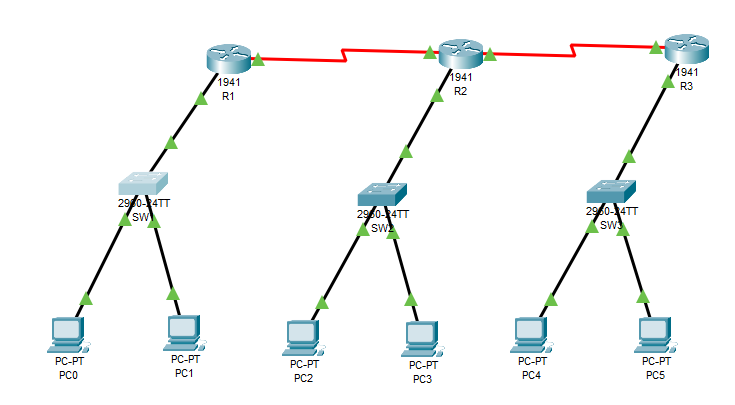

!
Feladat:
1) Adj IP címeket az eszközeidnek 
2) Alapkonfig minden hálózati eszközre! 
3) Statikus route beállítása 
4) Bármely gépről bármely hálózati eszközt távolról tudjunk konfigurálni

## **Hálózati topológia és IP-címek**

- **PC-k:** 6 darab, mindegyik egy switchhez csatlakozik (2-2 switchenként).
- **Switchek:** 3 darab, VLAN1 interfészükkel menedzselhetők.
- **Routerek:** 3 darab, egymással szakaszokkal összekötve.
- **Összekötő hálózatok:**
    - **R1 ↔ R2**: `10.10.10.0/24`
    - **R2 ↔ R3**: `10.10.20.0/24`
    - Az összekötő hálózatok az R2 routeren keresztül biztosítják a kommunikációt.

| Eszköz  | Interfész          | IP-cím        | Alapértelmezett átjáró |
| ------- | ------------------ | ------------- | ---------------------- |
| PC1     | FastEthernet0      | 192.168.1.2   | 192.168.1.1            |
| PC2     | FastEthernet0      | 192.168.1.3   | 192.168.1.1            |
| PC3     | FastEthernet0      | 192.168.2.2   | 192.168.2.1            |
| PC4     | FastEthernet0      | 192.168.2.3   | 192.168.2.1            |
| PC5     | FastEthernet0      | 192.168.3.2   | 192.168.3.1            |
| PC6     | FastEthernet0      | 192.168.3.3   | 192.168.3.1            |
| Switch1 | Vlan1              | 192.168.1.100 | 192.168.1.1            |
| Switch2 | Vlan1              | 192.168.2.100 | 192.168.2.1            |
| Switch3 | Vlan1              | 192.168.3.100 | 192.168.3.1            |
| Router1 | GigabitEthernet0/1 | 192.168.1.1   | -                      |
| Router1 | Serial0/0/0        | 10.10.10.1    | -                      |
| Router2 | GigabitEthernet0/1 | 192.168.2.1   | -                      |
| Router2 | Serial0/0/0        | 10.10.10.2    | -                      |
| Router2 | Serial0/0/1        | 10.10.20.1    | -                      |
| Router3 | GigabitEthernet0/1 | 192.168.3.1   | -                      |
| Router3 | Serial0/0/1        | 10.10.20.2    | -                      |

**PC-k konfigurálása** (Minden PC-n, a megfelelő adatokkal):
IP Address: 192.168.X.Y 
Subnet Mask: 255.255.255.0 
Default Gateway: 192.168.X.1

### **2) Alapkonfiguráció minden hálózati eszközre**

### Routerek beállítása (R1, R2, R3)

🔹 **R1 konfigurációja**
enable  
configure terminal  
hostname R1  
interface GigabitEthernet0/1  
ip address 192.168.1.1 255.255.255.0  
no shutdown  
exit  
interface Serial0/0/0  
ip address 10.10.10.1 255.255.255.0  
no shutdown  
exit  
exit  
write memory  

🔹 **R2 konfigurációja**
enable
configure terminal
hostname R2
interface GigabitEthernet0/1
ip address 192.168.2.1 255.255.255.0
no shutdown
exit
interface Serial0/0/0
ip address 10.10.10.2 255.255.255.0
no shutdown
exit
interface Serial0/0/1
ip address 10.10.20.1 255.255.255.0
no shutdown
exit
exit
write memory

🔹 **R3 konfigurációja**
enable
configure terminal
hostname R3
interface GigabitEthernet0/1
ip address 192.168.3.1 255.255.255.0
no shutdown
exit
interface Serial0/0/1
ip address 10.10.20.2 255.255.255.0
no shutdown
exit
exit
write memory

### Switchek beállítása (S1, S2, S3)
🔹 **S1 konfigurációja**
enable
configure terminal
hostname S1
interface Vlan1
ip address 192.168.1.100 255.255.255.0
no shutdown
exit
ip default-gateway 192.168.1.1
exit
write memory

🔹 **S2 konfigurációja**
enable
configure terminal
hostname S2
interface Vlan1
ip address 192.168.2.100 255.255.255.0
no shutdown
exit
ip default-gateway 192.168.2.1
exit
write memory

🔹 **S3 konfigurációja**
enable
configure terminal
hostname S3
interface Vlan1
ip address 192.168.3.100 255.255.255.0
no shutdown
exit
ip default-gateway 192.168.3.1
exit
write memory

## **3) Statikus útvonalak beállítása**
🔹 **R1-en**
enable
configure terminal
ip route 192.168.2.0 255.255.255.0 10.10.10.2
ip route 192.168.3.0 255.255.255.0 10.10.10.2
exit
write memory

🔹 **R2-n 
configure terminal 
ip route 192.168.1.0 255.255.255.0 10.10.10.1 
ip route 192.168.3.0 255.255.255.0 10.10.20.2 
exit
write memory

🔹 **R3-on**
configure terminal
ip route 192.168.2.0 255.255.255.0 10.10.20.1
ip route 192.168.1.0 255.255.255.0 10.10.20.1
exit
write memory

## **4) Távoli elérés beállítása Telnettel**

🔹 **Minden routeren és switchen engedélyezni kell a Telnetet és beállítani az enable jelszót.**
enable
configure terminal
line vty 0 4
password cisco
login
exit
enable secret adminpass
exit
write memory

## **5) Tesztelés**

🔹 **Pingelj egy másik alhálózatból lévő PC-t:**
🔹 **Pingelj egy routert vagy egy switch VLAN1 interfészét:**
🔹 **Teszteld a Telnetet egy PC-ről:**
telnet 192.168.1.1  (Router R1)
telnet 192.168.1.100 (Switch S1)

Bejelentkezés után:
Password: cisco
enable
Password: adminpass

